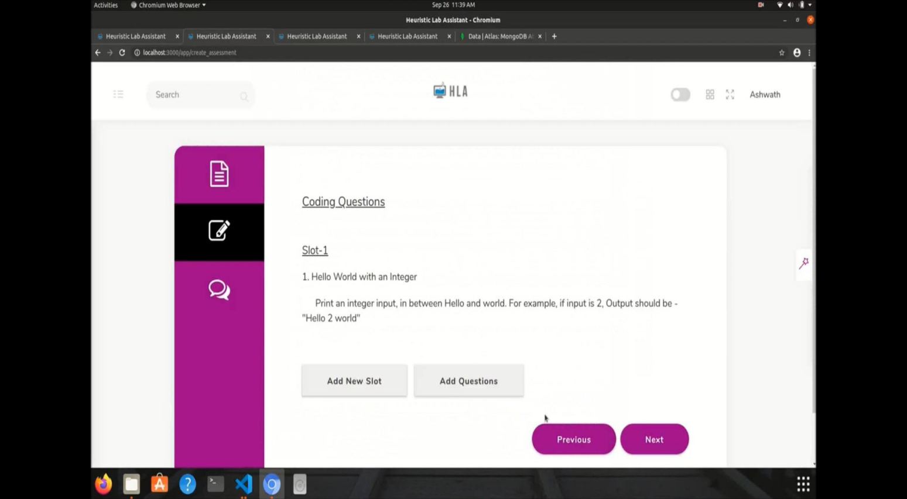
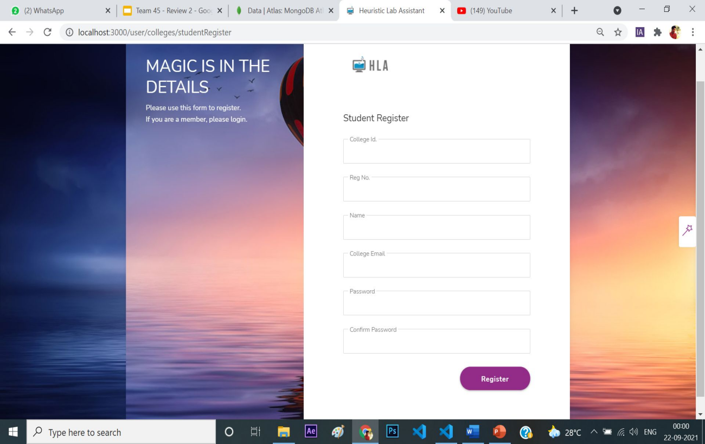

# Virtual Lab Assistant

## Demo

[](https://www.youtube.com/watch?v=97xkhX4tO6s)

## Description

This project is a comprehensive online platform designed to facilitate virtual lab assessments for computer science students. It provides an environment that simulates offline lab sessions, allowing instructors to monitor students, prevent malpractice, and engage with students effectively. The platform supports coding and viva assessments, with features like screen sharing, AI-based live monitoring, chat systems, and more.

## Features

- **User Modules**: Separate modules for colleges, staff, and students.
- **Easy Setup**: Import students and assessments via CSV files.
- **AI-Based Monitoring**: Detects unauthorized devices and multiple faces during assessments.
- **Communication Tools**: Built-in chat and screen-sharing options for student-teacher interaction.
- **Diverse Assessment Types**: Supports coding questions with test cases and multiple-choice questions for viva.
- **Secure Environment**: Prevents tab switching, copy-pasting, and unauthorized access during tests.

## Architecture

The platform consists of three main user modules:
1. **College Module**: College registration, admin management, and dashboard.
2. **Staff Module**: Classroom and assessment management, student monitoring, and evaluation.
3. **Student Module**: Assessment participation, report viewing, and communication with staff.

The AI-based monitoring system uses a pre-trained deep learning model (ssd_mobilenet_v1_coco) to detect malpractice during assessments.

## Screenshots








## Installation

1. Clone the repository:
   ```bash
   git clone https://github.com/yourusername/virtual-lab-assessment-platform.git
   ```
2. Navigate to the project directory:
   ```bash
   cd virtual-lab-assessment-platform
   ```
3. Install dependencies:
   ```bash
   npm install
   ```
4. Set up environment variables:
   - Create a `.env` file in the root directory.
   - Add your MongoDB URI, API keys, and other configurations.

5. Start the development server:
   ```bash
   npm start
   ```

## Usage

- **College Admin**: Register your college, manage staff and students, and monitor ongoing assessments.
- **Staff**: Create and manage classrooms, set up assessments, and monitor students during tests.
- **Students**: Participate in lab assessments, submit solutions, and view reports.

## Technologies Used

- **Frontend**: React.js, Bootstrap, HTML, CSS
- **Backend**: Node.js, Express.js
- **Database**: MongoDB
- **AI Monitoring**: TensorFlow, SSD MobileNet v1
- **Other Tools**: RapidAPI for the compiler, Socket.io for real-time communication

## Contributing

Contributions are welcome! Please follow these steps to contribute:
1. Fork the repository.
2. Create a new branch:
   ```bash
   git checkout -b feature/your-feature-name
   ```
3. Commit your changes:
   ```bash
   git commit -m "Add your message here"
   ```
4. Push to the branch:
   ```bash
   git push origin feature/your-feature-name
   ```
5. Open a pull request.

